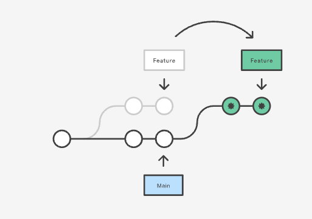
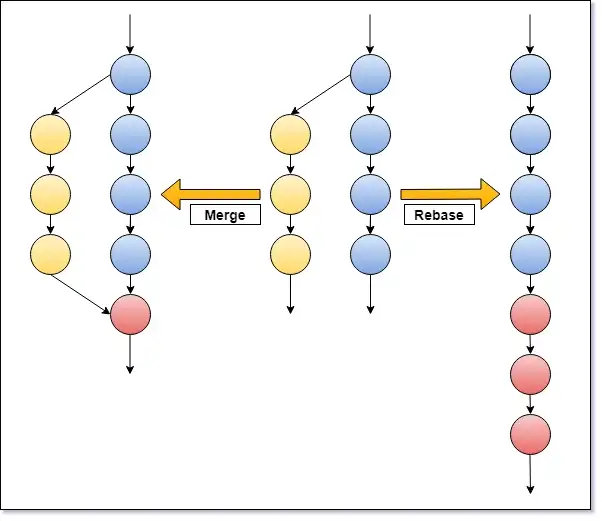

# Rebase Strategy

When you work with a team and everyone pushing many codes everyday probably you face so many conflict or even sometimes missing or overriding codes in your codebase.
There are a lot of different strategy to pick as team to prevent those mentioned issues

choosing best strategy for a team really depends to yourself and your team member and how much experience your team have.

One of the best strategy which personally i lik and also fight for it to do not apply it in our daily workflow is **Rebasing** this technic at beginning might scare everyone and add a little bit extra work but in longer term come with a lot of benefits and solve many problem.

## Case 1



Imagine you made a branch couple days ago and you are ready to merge or push your changes to main branch and your team mates made some changes and they already pushed their codes to main. So now your branch head is not anymore latest main. If you merge your code directly or make pull request probably you will get some conflict.
As you can see in above image you can rebase your feature branch to main branch and you will receive all new changes from main branch to your feature branch so you don't need to be worry anymore about conflict and you can go ahead and make your pull request without be worrying anything
Rebasing Will give you the clean and nice linear history so you can track whats changes merge to your main branch without having headache.



above photo shows different result in git history for merge strategy lets see how can we do this.

1. first step creating your branch
   
```
git checkout -b feature_branch main
```

1. From base branch then bring some changes in codebase.
2. Now times to stage and commit your changes with below command.
   
```
git add .
git commit -m "message"
```

3. imagine your team mate push some changes to your main and your base is very behind of origin base.

```
//checkout to base branch
git checkout baseBranch ( main )

//pull latest changes to your local base
git pull origin baseBranch
```
3. now times to rebase your branch to base branch.

```
// checkout to feature branch
git checkout featureBranch
// rebase feature branch from base branch

 git rebase baseBranch ( main )

 // push branch to origin
 git push origin featureBranch
```

Now you are safe and none conflict branch from base branch go ahead and make your pull request.

your github history and chart should be like below image now after merge your pull request.


## Case 2
# under writting
## bonus tips

1. if you want to don't get coughs with many changes always rebase with origin branch so you will not be far behind and rebasing will much easier